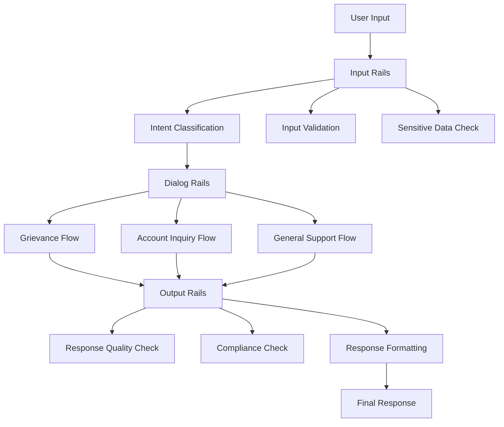

# NeMo Guardrails Configuration Guide

This document explains the enhanced configuration setup based on the [official NVIDIA NeMo Guardrails Configuration Guide](https://docs.nvidia.com/nemo/guardrails/latest/user-guides/configuration-guide/index.html).

## 📋 Configuration Components

Your FinanceBot project now includes all recommended configuration components:

### 1. **General Options** (`config/config.yml`)
- ✅ **LLM Configuration**: OpenAI GPT-4 Turbo with optimized parameters
- ✅ **Embeddings**: Text-embedding-ada-002 for knowledge base support  
- ✅ **Instructions**: Enhanced system prompts for FinanceBot
- ✅ **Sample Conversation**: Context examples for better understanding
- ✅ **Rails Configuration**: Input, output, and dialog rails
- ✅ **Custom Prompts**: Self-check prompts for compliance
- ✅ **Tracing**: Optional monitoring configuration
- ✅ **Exception Handling**: Default error responses

### 2. **Rails** (`config/rails/`)
- ✅ **Input Flows** (`input_flows.co`): User intent classification and validation
- ✅ **Output Flows** (`output_flows.co`): Response quality and compliance checking
- ✅ **Dialog Flows** (`dialog_flows.co`): Conversation management

### 3. **Actions** (`config/actions.py`)
- ✅ **Enhanced Actions**: 15+ custom actions for business logic
- ✅ **Flow Support**: Actions that support the new Colang flows
- ✅ **Security Features**: Input validation and sensitive data detection

### 4. **Prompts** (`config/prompts/`)
- ✅ **Context Templates**: Structured prompts for different scenarios
- ✅ **General Prompts**: Reusable prompt components

## 🔄 Migration from Legacy Configuration

### Before (rails.yaml)
```yaml
models:
  - type: main
    engine: openai
    model: gpt-4-turbo-preview

rails:
  input:
    flows:
      - self check input
  output:
    flows:
      - self check output
```

### After (config.yml)
```yaml
models:
  - type: main
    engine: openai
    model: gpt-4-turbo-preview
    parameters:
      temperature: 0.1
      max_tokens: 1000

embeddings:
  - type: main
    engine: openai
    model: text-embedding-ada-002

rails:
  input:
    flows:
      - check user intent
      - validate input
      - check for sensitive information
  output:
    flows:
      - check response quality
      - ensure compliance
      - format response
  dialog:
    flows:
      - grievance management flow
      - account inquiry flow
      - general support flow

# Plus enhanced instructions, sample conversations, tracing, etc.
```

## 🔧 Key Enhancements

### 1. **Enhanced LLM Configuration**
- **Temperature Control**: Set to 0.1 for consistent responses
- **Token Limits**: Optimized for financial services use case
- **Embedding Support**: Ready for RAG (Retrieval-Augmented Generation)

### 2. **Comprehensive Rails**
- **Input Rails**: 3 flows for thorough input processing
- **Output Rails**: 3 flows for response validation
- **Dialog Rails**: 3 flows for conversation management

### 3. **Advanced Actions**
- **Intent Classification**: Automatic routing based on user intent
- **Input Validation**: Security checks for sensitive information
- **Response Quality**: Automatic response improvement
- **Compliance Checking**: Financial regulation compliance

### 4. **Professional Flow Management**
- **Colang Flows**: Proper flow definitions in `.co` files
- **Business Logic**: Separate flows for different use cases
- **Error Handling**: Graceful handling of edge cases

## 🚀 Usage Examples

### Basic Usage
```python
from nemoguardrails import RailsConfig, LLMRails

# Load enhanced configuration
config = RailsConfig.from_path("config")
rails = LLMRails(config=config)

# Process messages with full flow support
response = await rails.generate_async(
    messages=[{"role": "user", "content": "I have a complaint"}]
)
```

### Testing Configuration
```bash
# Test the enhanced configuration
python test_config.py

# Run the demo with new features
python demo.py
```

## 📊 Configuration Comparison

| Feature | Legacy (rails.yaml) | Enhanced (config.yml) |
|---------|-------------------|----------------------|
| LLM Parameters | Basic | ✅ Advanced with temperature, tokens |
| Embeddings | ❌ None | ✅ OpenAI embeddings |
| Input Rails | 1 flow | ✅ 3 comprehensive flows |
| Output Rails | 1 flow | ✅ 3 validation flows |
| Dialog Rails | ❌ None | ✅ 3 conversation flows |
| Sample Conversation | ❌ None | ✅ Context examples |
| Tracing Support | ❌ None | ✅ OpenTelemetry ready |
| Exception Handling | ❌ Basic | ✅ Professional responses |
| Custom Actions | 8 actions | ✅ 15+ enhanced actions |

## 🔍 Flow Architecture



## 🛡️ Security Features

### Input Security
- **Credit Card Detection**: Pattern-based detection and blocking
- **SSN Protection**: Social Security Number identification
- **Inappropriate Language**: Profanity and abuse detection
- **Context Validation**: Ensures banking-related conversations

### Output Security
- **Data Masking**: Automatic masking of sensitive information
- **Compliance Disclaimers**: Investment advice disclaimers
- **Professional Tone**: Maintains appropriate business language
- **Information Filtering**: Prevents unauthorized data sharing

## 🔧 Customization Guide

### Adding New Rails
1. Create new `.co` files in `config/rails/`
2. Define flows using Colang syntax
3. Reference flows in `config.yml`
4. Add supporting actions in `actions.py`

### Modifying LLM Behavior
1. Update `instructions` in `config.yml`
2. Modify `sample_conversation` for context
3. Adjust model parameters (temperature, tokens)

### Enhancing Security
1. Add new patterns to validation actions
2. Update compliance checking logic
3. Modify sensitive data detection rules

## 📚 Additional Resources

- [NVIDIA NeMo Guardrails Documentation](https://docs.nvidia.com/nemo/guardrails/latest/)
- [Colang Language Reference](https://docs.nvidia.com/nemo/guardrails/latest/colang_2/language_reference/)
- [Configuration Guide](https://docs.nvidia.com/nemo/guardrails/latest/user-guides/configuration-guide/)

## 🆘 Troubleshooting

### Common Issues

1. **Configuration Loading Errors**
   ```bash
   python test_config.py  # Test configuration
   ```

2. **Flow Parsing Errors**
   - Check Colang syntax in `.co` files
   - Ensure proper indentation
   - Validate flow references in `config.yml`

3. **Action Registration Issues**
   - Verify `@action()` decorators
   - Check import statements
   - Ensure proper async/await usage

### Getting Help

1. Run the configuration test: `python test_config.py`
2. Check the demo: `python demo.py`
3. Review logs for specific error messages
4. Refer to the official documentation

---

**Your enhanced NeMo Guardrails configuration is now ready for production use! 🚀**
